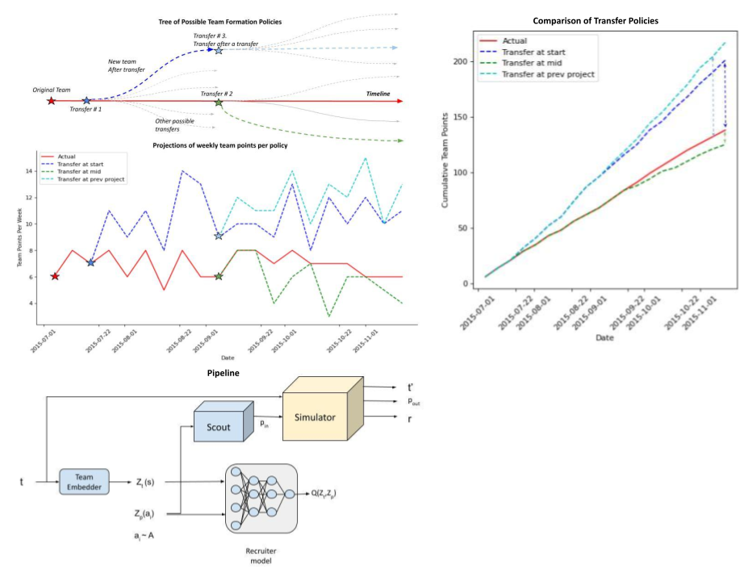

# Better Late than Never - Suboptimal Player Transfer Strategy

This is the code repository for the implementation of a Monte Carlo Policy Iteration Learning over the Fantasy Premier League player transfer strategies. The combination of the model and the player embedding allows a degree of interpretability to make sense of transfer strategies.

## Files :

* simulator.py - Simulator class which keeps tracks of the ids, cost , points for the current FPL manager. All tranfers in/out are updated over the running variables. This class takes in the fpl manager id, number of weeks and the required columns. Based on this the dataframes are loaded from CSVs and tracked.
* scout.py - This handles the transfer in and out based on player cost, current balance and minimum balance. The general idea is weaker players in our team are swapped out with strong players from the pool of players. Only the affordable ones. 
* recuiter.py - This is the neural network model which takes in states, action and the current week to produce the Q(s,a) value. This is an interpretation of how good the states are. 
* simulator.ipynb - This is the main notebook which needs to be run. This contains the MC policy evaluation and iteration code along with training and evaluation.

## Training

