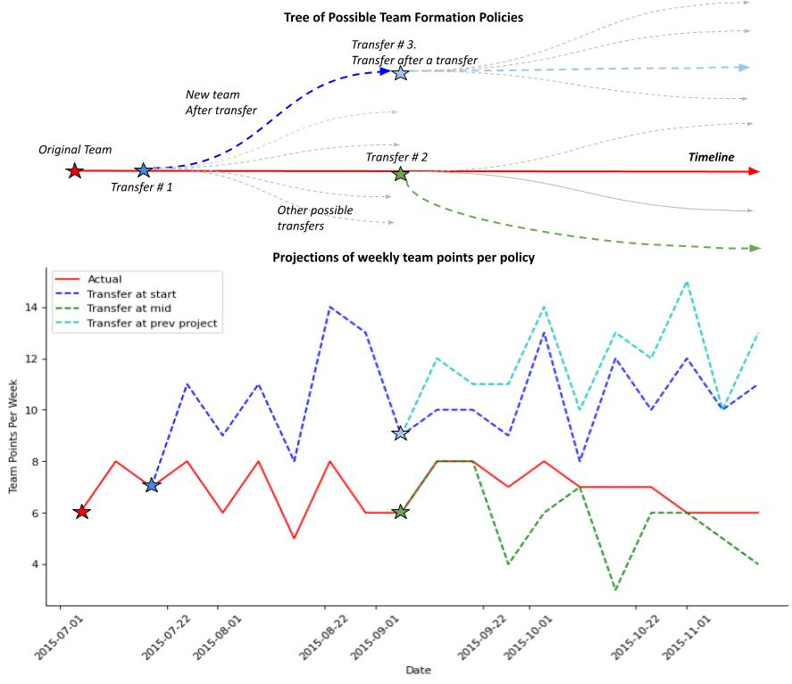

# Better Late than Never - Suboptimal Player Transfer Strategy

This is the code repository for the implementation of a Monte Carlo Policy Iteration Learning over player transfer strategies. The combination of the model and the player embedding allows a degree of interpretability to make sense of transfer strategies.

Parameters  to work on :

 1. Reward function is based on current vs new team difference. So what if no team transfer takes place is it reward 0 and we pass a zero vector action profile to NN (so that say no transfer takes place). Or do we set reward to -1 and make it transfer with some profile
	
	So r = 0 when prev_team.points >= new_team.points else r = -1 with epsilon a little high to prevent the NN from learning no transfers are the way to go
	    Or  r = 0 when  prev_team.points > new_team.points else r = -1 with little bit of epsilon

2 . Should we have a state vector which includes player points vector , and current week as one hot ? 

3 . Each transfer itself is also an episode right? So we need to do some special processing for this? If thats the case we need to some combinatorial selection of transfers and make them an episode?

TODOs:
1. transfer in/out implementation (priyanka)
2. rankings table for every game week [priyanka]
3. apply this wherever - step function etc (JJ)
4. episode replication function (JJ)
5. player embedding refinement (anshuman)
6. read cost from csv (JJ)
7. sanity checks - 
	 1. transfer in/out should be possible at every week -do some random transfers at every game week (using some random player profile) [priyanka]
	 2. player embedding over every game week

